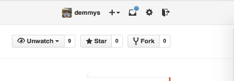
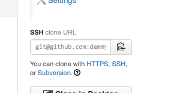
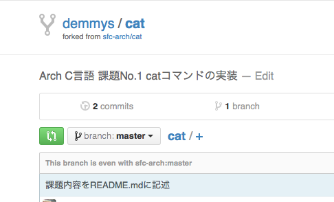
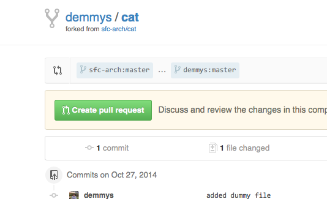
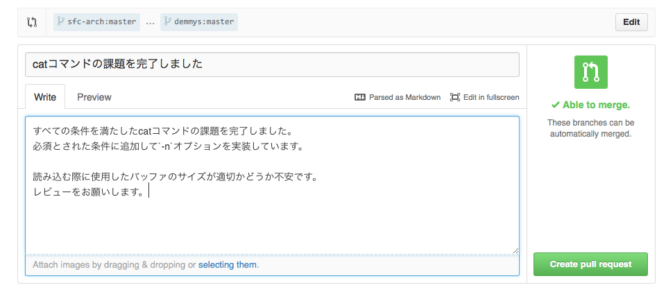

課題の進め方と提出方法
=====

#### 1.対象の課題レポジトリをForkする

対象の課題のレポジトリへ移動し、ウィンドウ右上の`Fork`ボタンを押すと自分のレポジトリとして課題レポジトリのコピーを作成することができます。



#### 2.レポジトリをローカルにクローンする

下の画像にあるForkしたレポジトリのURL(git@github.com:<ユーザ名>/<レポジトリ名>.git)をクリップボードにコピーし、下記のコマンドでローカルにクローンします。



```
$ cd <レポジトリのクローンを作成したいディレクトリ>
$ git clone git@github.com:<ユーザ名>/<レポジトリ名>.git
$ cd <レポジトリ名>
```

#### 3.クローンしたレポジトリに課題内容をプッシュする

課題のために書いたプログラムを手順2でクローンしてできたディレクトリでコミット・プッシュします。

```
$ cd <クローンしてできたディレクトリ>
$ vim
# プログラムを記述
$ git add .
$ git commit
$ git push origin master:master
```

#### 4.PullRequestを送って課題を提出する

課題を完了したら、GithubからリモートレポジトリにPullRequestを送ることで課題を提出します。
PullRequestは下の画像のように矢印マーク(Compare and Pull requestボタン)を押したあと、`Create pull request`ボタンで作成します。





PullRequestを作成する画面に移るので、下の画像のように、適切なタイトルと加えて実装した機能や不安な部分などをコメントに書いて`Create pull request`ボタンでPullRequestを送信します。
コメントはなるべく丁寧に書くよう気をつけましょう。



#### 5.レビューの内容をプログラムに反映する

PullRequestに対してレビューが来たら、その箇所をすぐに編集してコミットを追加します。
提出のためにクローンして作ったディレクトリで続けて変更をコミットし、手順3の時と同じように再度プッシュを行うと、先に作ったPullRequestに新しく作成したコミットが追加されます。
レビューを反映したコミットを追加したら、その旨をレビューをくれた人にPullRequest上のコメントで伝えましょう。

#### 6.課題が完了したらPullRequestをマージしてもらう

レビューの反映が終わったら、レビューをしてくれた人にPullRequestのマージをお願いしましょう。
この際、ファイル名が他の人の提出したものと被っていたり、余計なファイルが混ざっていたりすることがないよう注意してください。
PullRequestがマージされた時点で、その課題は終了となります。
